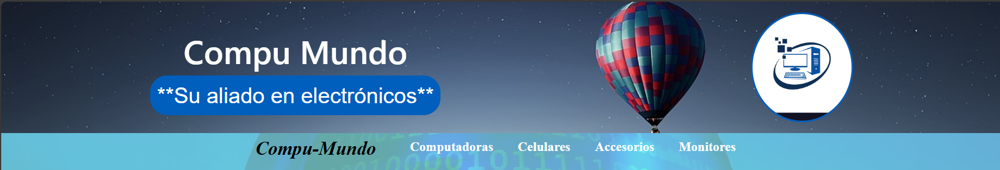

# CURSO CODERHOUSE REACT JS

## Proyecto Final e-commerce

### _Compu-Mundo_

Tienda de aparatos electrónicos en linea.

El proyecto permite navegar entre diferentes categorías de productos, ver los detalles de producto, agregar al carrito (en este caso agregar a la "canasta" 😁), vaciar el carrito o terminar la compra generando una orden de compra en la base de datos de Firestore.

Proyecto realizado con **React js + VITE + Bootstrap**

Ademas integra estilos de **CSS** puro con archivos locales en algunos componentes.

